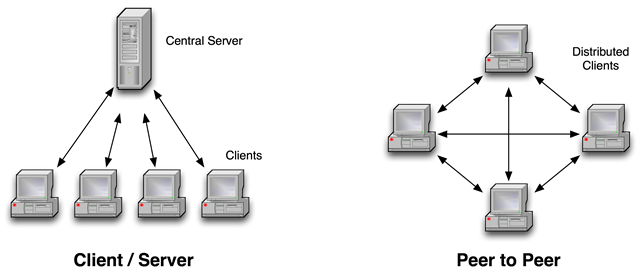

# Basics

## Introduction
Evergrowing intrest in multiplayer games is strongly connected to game development industry, as it is the task of developers to deliver those games. Unity no longer supports UNet and using third-party assets may not be as good as making custom networking. Each game has it's own needs.

## Network
Our computers are connected. Sending packets of data by using IP set in our Network Card has so many applications in our modern world that even entertainment has to be delivered in that way. Computer Networks is a big topic. Developers should be aware of many mechanisms used in data transmission. Especially when it comes to UDP and TCP.

## UDP and TCP
They are IP protocols used in sending and receiving data. UDP is lightweight, fast, simple datagram sending protocol, while TCP is based on establishing connection, control and making sure everything is delivered in order (like a stream). Which one should you use? Depends. UDP is a very good choice if a game takes place in real-time such as First Person Shooter. TCP is much easier to use in turn-based games or even in real-time games where latency is not a big deal. However, programmer can make UDP to be reliable just like TCP, but this requires extra work. 

## Game Data, Game Logic
Very important tip on making own game in general, not only a multiplayer one, is to differ between data and logic. Game uses some **Game Data** such as positions of objects, where **Game Logic** operates on those objects based on some external input. In Unity this is simplified or doesn't seem to have sense. Many tutorials focus on making **a singleplayer game**. Worth noting is the fact that if you develop your game as a multiplayer game then it is not a problem to make it singleplayer. Singleplayer is only a multiplayer with one player being on the server. Rule doesn't work in reverse. It is hard to make a multiplayer game from solely singleplayer game.

## Multiplayer
By using this division of Game Data and Game Logic, we come into a conclusion that a multiplayer game should aspire to equalize all Game Datas of connected players. Any Game Logic operations done by a Player A should be noticed by a Player B and vice versa.  

## Server Authority and Peer-To-Peer

There are two architectures that are crucial in planning a multiplayer game. Developer must consider this idea: *Should those operations done by the Player A be sent to one chosen Player S and then resent to all the other players? Or maybe Player A should just sent it to all the other players?* Both solutions have their advantages and disadvantages. Competetive games can't be peer-to-peer as a lack of an authority would be a serious issue: cheating. Authoritative server also returns back all the input we have made as a confirmation, so our Game Logic can operate on Game Data. This generates some latency. However it makes a control over Game Data much easier, because we always have one trustworthy source of current game state.

## What's next?
In the next tutorial we will see how effectively implement the Game Logic using a Command Pattern. This is a very useful design pattern, not only in game development, but in programming in general. Tutorial won't cover all the code you need. You can see it in this repository, what I want to do is to explain what is the idea behind it. 

[Next ->](02commandPattern.md)
